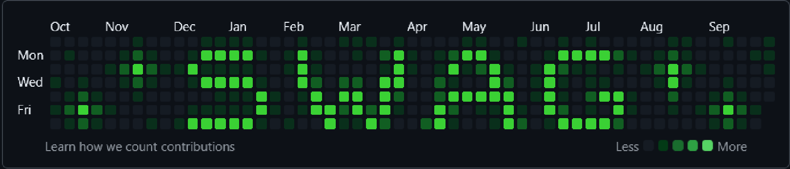

<div align="center">

<!-- BANNER: replace with your banner path -->


<br><br>

<!-- PHOTO: replace with your photo path -->


# MARKIII

### `C / C++` · `Python` · `Django` · `JavaScript`

<br>

[](https://github.com/Markiaaaan)
[](https://github.com/Markiaaaan)

</div>

---

## 👨‍💻 About Me

```text
> developer
> learning C / C++, Python, how not to be expelled from college
> exploring machine learning
> always learning something new
```

---

## ⚡ Tech Stack

### Languages

<p>
  
</p>

### Web Development

<p>
  
</p>

### Tools & Environment

<p>
  
</p>

---

## 🚀 Featured Projects

<table>
<tr>
<td width="50%">

### 💻 C / C++

Algorithms, experiments and low-level programming.

</td>
<td width="50%">

### 🐍 Python / Django

Backend development and web applications.

</td>
</tr>

<tr>
<td width="50%">

### 🌐 Web

HTML, CSS and JavaScript projects.

</td>
<td width="50%">

### 🔧 Other

Small tools, experiments and things I'm currently building.

</td>
</tr>
</table>

---

## 📊 GitHub Stats

<div align="center">


</div>

##🔥 Activity

<div align="center">


</div>

##📈 Contribution Graph

<div align="center">


</div>

---

<div align="center">

### `while(alive) { code(); }`

**Thanks for visiting my profile.**

</div>
